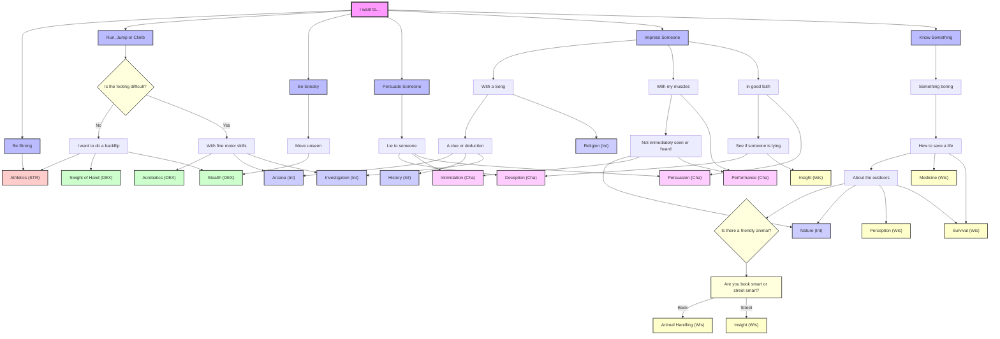

# I Want To... Flowchart

```mermaid
flowchart TD
    Start["I want to..."]
    
    %% Main Options
    Start --> BeStrong["Be Strong"]
    Start --> RunJump["Run, Jump or Climb"]
    Start --> BeSneaky["Be Sneaky"]
    Start --> Persuade["Persuade Someone"]
    Start --> Impress["Impress Someone"]
    Start --> Know["Know Something"]
    
    %% Run, Jump or Climb branch
    RunJump --> Difficult{"Is the footing difficult?"}
    Difficult -->|No| Backflip["I want to do a backflip"]
    Difficult -->|Yes| FineMotor["With fine motor skills"]
    
    %% Be Sneaky branch
    BeSneaky --> MoveUnseen["Move unseen"]
    
    %% Persuade Someone branch
    Persuade --> LieToSomeone["Lie to someone"]
    
    %% Impress Someone branch
    Impress --> WithSong["With a Song"]
    Impress --> WithMuscles["With my muscles"]
    Impress --> InGoodFaith["In good faith"]
    
    %% Know Something branch
    Know --> SomethingBoring["Something boring"]
    SomethingBoring --> SaveLife["How to save a life"]
    SaveLife --> Outdoors["About the outdoors"]
    
    %% Sub-branches for Impress
    WithSong --> Clue["A clue or deduction"]
    WithMuscles --> NotImmediate["Not immediately seen or heard"]
    InGoodFaith --> SeeLying["See if someone is lying"]
    
    %% Outdoors branch
    Outdoors --> FriendlyAnimal{"Is there a friendly animal?"}
    FriendlyAnimal --> BookSmart["Are you book smart or street smart?"]
    BookSmart -->|Book| AnimalHandling["Animal Handling (Wis)"]
    BookSmart -->|Street| Insight1["Insight (Wis)"]
    
    %% Skill Outcomes - Left Column (Athletics/Acrobatics)
    Backflip --> Athletics["Athletics (STR)"]
    BeStrong --> Athletics
    
    FineMotor --> Acrobatics["Acrobatics (DEX)"]
    
    Backflip --> SleightHand["Sleight of Hand (DEX)"]
    
    Backflip --> Stealth["Stealth (DEX)"]
    MoveUnseen --> Stealth
    
    %% Skill Outcomes - Middle Column (Intelligence)
    Clue --> Arcana["Arcana (Int)"]
    FineMotor --> Arcana
    
    Clue --> History["History (Int)"]
    
    Clue --> Investigation["Investigation (Int)"]
    FineMotor --> Investigation
    
    NotImmediate --> Nature["Nature (Int)"]
    Outdoors --> Nature
    
    WithSong --> Religion["Religion (Int)"]
    
    %% Skill Outcomes - Right Column (Charisma)
    LieToSomeone --> Deception["Deception (Cha)"]
    SeeLying --> Deception
    
    LieToSomeone --> Intimidation["Intimidation (Cha)"]
    NotImmediate --> Intimidation
    
    WithMuscles --> Performance["Performance (Cha)"]
    NotImmediate --> Performance
    
    InGoodFaith --> Persuasion["Persuasion (Cha)"]
    LieToSomeone --> Persuasion
    
    %% Skill Outcomes - Far Right Column (Wisdom)
    AnimalHandling
    
    Insight1
    SeeLying --> Insight2["Insight (Wis)"]
    
    SaveLife --> Medicine["Medicine (Wis)"]
    
    Outdoors --> Perception["Perception (Wis)"]
    
    SaveLife --> Survival["Survival (Wis)"]
    Outdoors --> Survival
    
    %% Styling
    classDef startNode fill:#f9f,stroke:#333,stroke-width:4px
    classDef optionNode fill:#bbf,stroke:#333,stroke-width:2px
    classDef decisionNode fill:#ffd,stroke:#333,stroke-width:2px
    classDef skillNode fill:#bfb,stroke:#333,stroke-width:2px
    classDef strSkill fill:#ffcccc,stroke:#333,stroke-width:2px
    classDef dexSkill fill:#ccffcc,stroke:#333,stroke-width:2px
    classDef intSkill fill:#ccccff,stroke:#333,stroke-width:2px
    classDef wisSkill fill:#ffffcc,stroke:#333,stroke-width:2px
    classDef chaSkill fill:#ffccff,stroke:#333,stroke-width:2px
    
    class Start startNode
    class BeStrong,RunJump,BeSneaky,Persuade,Impress,Know optionNode
    class Difficult,FriendlyAnimal,BookSmart decisionNode
    class Athletics strSkill
    class Acrobatics,SleightHand,Stealth dexSkill
    class Arcana,History,Investigation,Nature,Religion intSkill
    class AnimalHandling,Insight1,Insight2,Medicine,Perception,Survival wisSkill
    class Deception,Intimidation,Performance,Persuasion chaSkill
```
